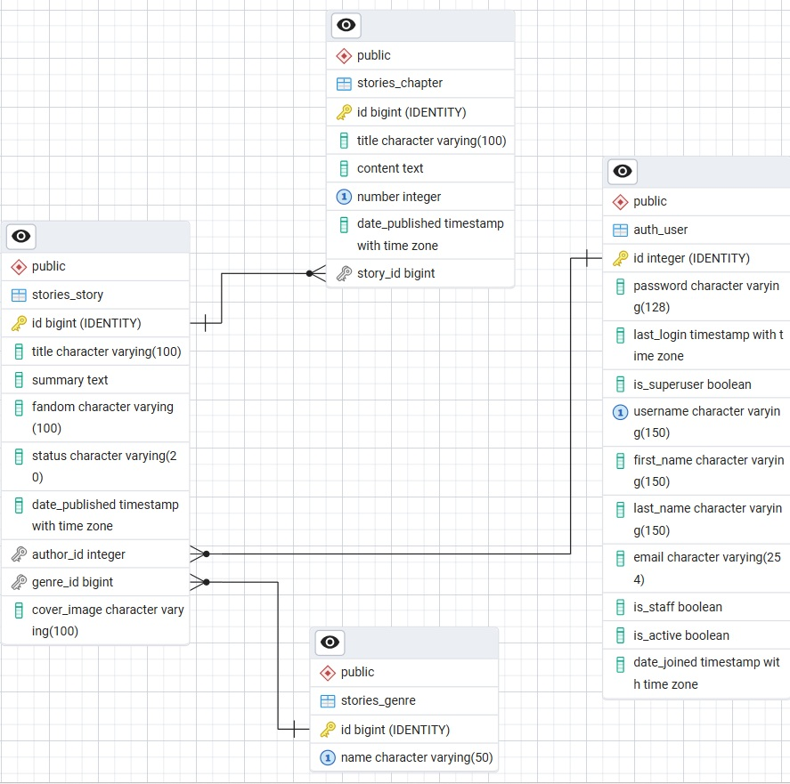
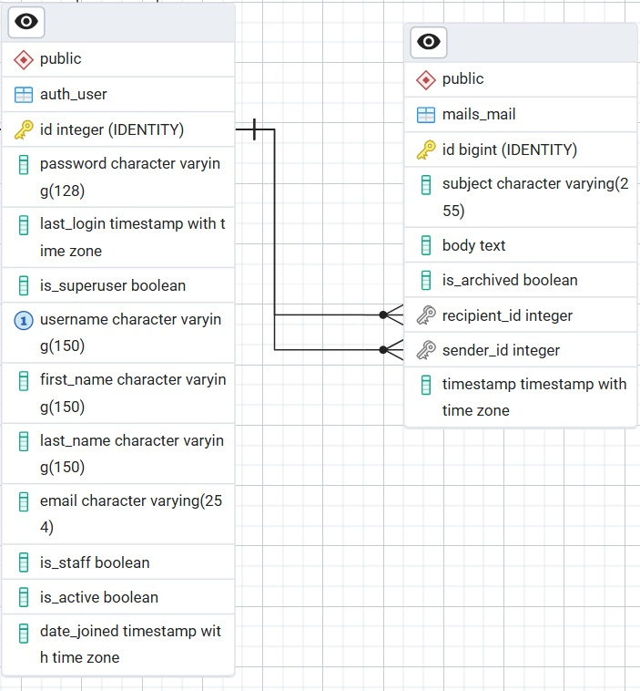

# Documentation

## User stories

### Personas
* Authors
* Readers

### Author user stories:

#### 1. Write stories
[MUST] As an author, I want to write fan fiction stories online, so I can share them with friends.

#### 2. Only publish when ready
[MUST] As an author, I want to save a draft of my story, so I can publish it only when it is ready.

#### 3. Multiple chapters per story
[MUST] As an author, I want to split my story into chapters, so I can publish one chapter at a time.

#### 4. Reorder chapters
[MUST] As an author, I want to be able to reorder my chapters, so I can change the order of chapters in my short story collections.

#### 5. Cover images
[MUST] As an author, I want to add images, so I can include covers for my stories.

#### 6. Editing
[MUST] As an author, I want to edit my published stories, so I can correct typos.

#### 7. Genres
[MUST] As an author, I want to put my stories in cateogires, so readers can see what genre they are.

#### 8. Sending and receiving messages
[MUST] As an author, I want to receive messages from other users, so I can get feedback on my work.

#### 9. Archiving messages
[MUST] As an author, I want to archive messages, so I can hide unfavourable feedback.

<br>

### Reader user stories:

#### 1. Story metadata
[MUST] As a reader, I want to see a story summary and metadata, so I can judge whether the story would be interesting to read.

#### 2. List stories from an author
[MUST] As a reader, I want to see a list of all stories from a user, so I can read all works from my favourite authors.

#### 3. Message authors
[MUST] As a reader, I want to send messages to authors, so I can give them feedback on their work.

<br>

### Future stories:

#### 1. Add co-authors
[SHOULD] As an author, I want to add additional authors to my stories, so I can show who my co-authors are.

#### 2. Search functionality
[SHOULD] As a reader, I want to search for stories by genre or fandom, so I can find stories I want to read.

#### 3. Mark as read
[SHOULD] As a reader, I want to mark stories as 'read', so I can keep track of what I've read.

<br>
<br>

## Content

The site will include:
- Homepage showing published stories, pagination, nav bar 
- Sidebar containing context-related user actions
- Full authentication (register, login, logout, etc)
- Profile/account page
- Private messaging inbox and archive

For authors:
- A 'new story' page for creating new stories
- An editable detail page showing metadata for a story, as well as links to chapters
- 'Add a chapter' page, allowing the author to write more chapters
- A page for deleting stories

For readers:
- Story detail pages, featuring metadata about the story
- Chapter pages, with internal story navigation
- A page listing all of an author's stories

<br>
<br>


## Wireframes

I created basic wireframes in Figma for mobile and desktop, with the mobile layout responsively catering for tablets too.

<br>
<br>


# My development process
## How I went about it

The following is a step-by-step account of how I did the project, which closely corresponds with the series of commits I made to the repo.

- Set up new Git in GitHub and cloned into VSCode
- Brainstormed initial ideas for the assignment
- Wrote user stories
- Designed the database schema
- Set up the Django environment as per the tutorials
- Created superuser
- Created the first model, `Story`, and added some stories via a shell
- Updated the homepage to loop through stories
- Set up Registration page and successfully registered new users
- Installed Crispy Forms with Bootstrap styling
- Created login and logout pages and completed user authentication setup
- Added editable profile pages and resizable profile picture upload
- Set up class-based views for CRUD operations
- Pagination added to the homepage
- New page showing a list of all stories from a user, with pagination
- Set up a burner email account and created the Password Reset infrastructure
- Swapped Bootstrap 5 for Bootstrap 4 to catch some legacy style classes
- Created a new form for adding chapters, and allowed authors to add chapters to their stories
- Added publish/unpublish functionality
- Set it up so that if a book was published once & then unpublished, the original publish date would persist
- Created a new app called `Mails` to handle user-to-user messaging (as per the assignment requirements)
- Continued updating the UI
- Added a word count using javascript to the Add chapter section
- On the story detail page, I used SortableJS to set up a drag-and-drop reordering of chapters
- Spent a lot of time troubleshooting the deployment of the site to Render.com.
- Fixed bug where not uploading a cover image crashed everything
- Set up Cloudinary and updated the Profile model, removing references to Pillow
- Changed Story model to work with Cloudinary and updated templates
- Wrote unit tests for the Story app
- Tidied up formatting, CSS etc, and cleared up the majority of 'Problems' from the Terminal
- Wrote docstrings for all model classes
- Ran Ruff linter and formatter for a final tidy-up of the code
- Added favicon.ico

<br>
<br>

# Project Details

## 1. Application structure
### Backend Framework
I followed Yoni's lessons to set up the Django framework.

### Database
I initially worked locally with SQLite, and when deploying I changed the database to Postgres. I broken down what table and relationships I would neeed.

Tables:
* User
* Profile
* Story
* Chapter
* Genre
* Mail

1. User → Profile (One-to-one)
2. User → Story (One-to-Many)
3. Genre → Story (One-to-Many)
4. Story → Chapter (One-to-Many)
5. User → Mail (One-to-Many) - as SENDER
6. User → Mail (One-to-Many) - as RECIPIENT


#### ERD

I made an ERD of the tables I needed in pgAdmin. I mapped out the columns I wanted to use, what the relationships were and which were the Primary and Foreign Keys.

This ERD captures the relationships between the `stories_story`, `stories_chapter`, `stories_genre` and `auth_user` tables:



And this ERD shows the relationship between the users and the mail table for the `mails` app.



<br>

### Frontend

I used HTML, CSS (powered by Bootstrap) and Javascript to build the frontend.

I used Django templates the build the pages.

<br>

## 2. Core features

### User management

Again, I followed Yoni's lessons closely here to ensure that the user management structure was set up correctly and met best practices.  I created the `users` app, and extended the built-in `get_user_model` with my `Profile` model. 

Users can:

- Register, login and logout via the register.html, login.html and logout.html templates
- Edit their personal details, including adding a profile picture
- Reset their password via an automated email, sent from a burner Gmail account (read more on this in Challenges below)

### Data storage

#### Stories app
The main purpose of the site is to allow writers to share their fanfiction stories online. To this end, I set up models to capture metadata around stories (title, genre, summary, etc) as well as a separate table for the chapter content itself. 

Example: The user first creates a story. This is added to the `stories_story` table. It contains metadata like title, genre, fandom, cover image, and the author's id (via a foreign key from the `auth_user` table).

It was also important to allow the user to save a draft of their story prior to publication. This is stored in the `status` column of `stories_story`. I wrote a function-based view for this instead of a class-based view, as it's a simple function that I didn't want to overcomplicate.

Note: For the sake of 'authenticity', once a story is published, its date is fixed (i.e. if it's subsequently changed from published to draft mode, the original publication date still stands).

#### Creating chapters

After creating a story, the user can then create chapters. These contain the actual story content. 

Each chapter is a row in the `stories_chapter` table. There, the `story_id` column uses a foreign key from the `stories_story` table. It's a one-to-many relationship, where one story can have many chapters.

#### Storing genre separately
It's also worth noting that I gave Genre its own table, `stories_genre`. All that's in it is a list of genres. From research, this seemed like best practice, as this list can now be easily added to by the superuser in the admin panel.

#### Image storage
Image storage was important for this project, as writers would want to store 'cover images' for their stories. I initualy used Pillow for this, as per the course lectures, and then eventually switched to Cloudinary when deploying. See Challenges below for issues encountered while deploying.


#### Mails app

Another significant area of data storage was for the messaging system. I created an app called `mails` to allow users to message each other. Users can message writers via their story detail pages. Those messages appear in the writers' private mailbox, which they can then archive if they wish. All archived messages appear on a private archive page.

When a user writes a message, it's added as a new row to the `mails_mail` table. The `sender_id` and `recipient_id` columns use foreign keys from the `auth_user` table, i.e. they record which users are sending and receiving the messages.  

Note: The `mails` app is currently quite basic. I stuck to what was required in the course PDF guide ("Inbox functionality where users can send, receive, and archive messages"). Given more time I would like to add additional features such as the ability to reply, show conversations, etc.

<br>

## 3. User interface

### Bootstrap

I used a mix of Bootstrap and CSS to create responsive layouts that work on desktop and mobile. 

Note that I used Bootstrap 4 rather than 5, as some of the class tags used in the course examples used 4.

### HTML templates

I used Django templates the build the pages. The  headers, navigation etc. are all in the base.html file, which is used on each page.

I created a second block in the base template, for the 'actions sidebar'. It changes depending on the context, e.g. when reading a chapter, the actions are replaced with the list of chapters with links.

### Javascript

I have included 2 notable examples of Javascript functionality in the site:

#### a. Drag-and-drop chapter reorder

On the story detail pages (on desktop), the user can drag and drop the chapters by grabbing the handles to the left of the chapter names. This reorders the chapters. I used the JS library Sortable for the drag and drop functionality.

My first draft required the user to press a 'Save chapter order' button after they'd rearranged the chapters. This was not great UX, so I revised the JS so that dragging and dropping a chapter to a new position automatically updated the database. This made for a much smoother UX.

#### b. Word count
My second example of Javascript is more basic but also improves the UX.  On the `/add-chapter` form, I believed it would be useful for authors to see a word count when they're writing. So, I used JS to show a word and character count under the text area field.

<br>

## 4. Security features

I followed the course lectures to ensure that the site followed best practices for data encryption. All passwords are hashed in the database. 
The password reset successfully uses a burner Gmail account to send emails to users (see the Challenges section for more on this).

I made sure that only logged-in users could see certain areas of the site (e.g. for writing stories). For function-based views, I used decorators such as `@login_required`. For class-based views, I used mixins such as `LoginRequiredMixin`.

I ensured that only the authors of a story are able to edit it. For class-based views, I used `UserPassesTestMixin` and `test_func` to check that the user was the author of the story or chapter.

For the admin dashboard, I used the standard Django distinction between staff and non-staff user roles.

<br>

## 5. Extension capabilities

The site is fully capable of future extension. I hope to eventually rebuild the frontend using React. I also hope to use 3rd-party APIs such as Resend (see Challenges below).
The `mails` app is quite basic at the moment, and I would like to develop it further.

<br>
<br>

# Challenges faced

Challenges I faced include:

## Deploying the Render.com

As expected, I encountered many issues when deploying.

### Reset Password works locally

Locally, I successfully set up the Reset Password feature to work with a burner Gmail account. However, when I deployed, I couldn't get it to work. After much tinkering with the code, it appears that Render.com is blocking SMTP services for the free tier.  https://render.com/changelog/free-web-services-will-no-longer-allow-outbound-traffic-to-smtp-ports

Ideally, I would switch over to a different service such as Resend, but I didn't have time to make the switch. But please note that it works locally.

### Default images

I followed Yoni's lesson on changing over from Pillow to Cloudinary so it was largely straightforward. However, I encountered issues with the default images. It took me a while to realise that with the new Cloudinary approach, the defaults should be placed in the relevant static folders, rather than the media folder. They work fine now.

## Mails app

I initially tried to use a third party Django app to handle the user-to-user messaging system. I tried django-postman but struggled to get it to work. I ended up abandoning the third party option and instead created a new app myself called `mails`.

With more time, I would research other third party apps.

## Missing Profile __str__

When doing a final check I noticed that the Profile objects in the dashboard looked like this:


I realised that when following the Cloudinary lesson, the code in the Github (Unit 12) omits the `__str__` method. I restored it in my code and the Profile was fine.


<br>
<br>

# Testing

I followed Yoni's lecture on testing, writing tests and following the Red Green Refactor method. I wanted to write tests for all 3 apps (`stories`, `users` and `mails`). But, given that I was running out of time, I focused on the models for just the `stories` app. With more time, I would ensure testing was set up for all apps, models, etc.

Challenges I faced include:

### Images
Tests that involved images kept failing (i.e. the story cover image). I researched a workaround and went for the simplest route of adding an if statement to `settings.py`: 
```
if 'test' in sys.argv:
    STATICFILES_STORAGE = 'django.contrib.staticfiles.storage.StaticFilesStorage' 
```

### test_stories_list_view
This, the first test I created, was throwing an error in the Terminal. Then I realised that stories are created as draft by default, and so the test story was effectively invisible. So, in the `setUp`, I set `status` to `published`. This solved the problem for this and other tests. 

### test_create_post_view
I couldn't figure out why this test kept failing, so I used `print(response.context['form'].errors)` to see what error messages the page was throwing. The required `genre` select was the problem.  I had to figure out how to pull in a genre from the Genre table, which took a while.

### test_update_story_view
Again I had to add all required fields here.  The `status` was the problem this time, i.e. it was a required field that I needed to include in the test.

<br>
<br>

# Additional notes

## pyproject.toml

I used this instead of a requirements.txt file. From research, it seems that this is sufficient for deployment so I left out the requirements.txt file.

## Pagination

Pagination can be seen on the homepage, once the number of published stories is 5 or more.
